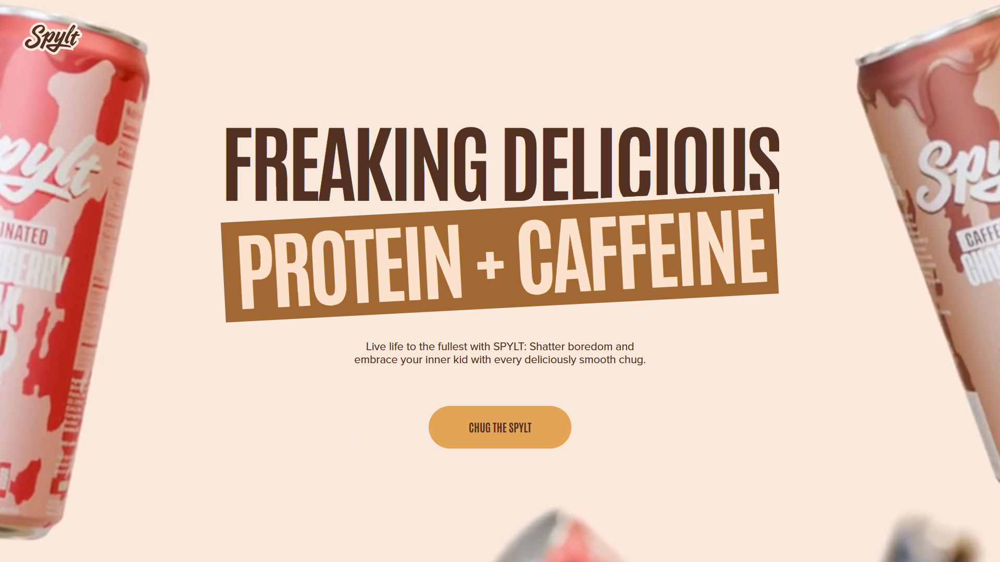

# SPYLT Clone

Frontend recreation and learning project inspired by **[Spylt](https://www.spylt.com/)** — the Awwwards-winning website for high-protein caffeinated chocolate milk (designed by Tubik Studio).

Focus: smooth scroll animations, modern product-focused layout, responsive design, and engaging micro-interactions.

Built with **React**, **Vite**, **Tailwind CSS**, and **GSAP** (with ScrollTrigger for scroll-based effects).

  
*(Add real screenshots/GIFs of your animations later)*

## ✨ Features

- GSAP-powered scroll-triggered animations and reveals
- Utility-first styling with Tailwind CSS
- Responsive design (mobile-first approach)
- Clean, component-based React structure
- Lightning-fast development with Vite + HMR

## 🛠️ Tech Stack

- **React** 18 (Vite + React plugin)
- **Vite** — next-gen frontend tooling
- **Tailwind CSS** — for rapid, consistent styling
- **GSAP** (GreenSock) + **ScrollTrigger** — high-performance animations
- JavaScript + modern CSS
- ESLint (keeping code clean)

## 🚀 Quick Start

```bash
# 1. Clone
git clone https://github.com/Rakib-dhali/spylt-clone.git
cd spylt-clone

# 2. Install dependencies (includes gsap & tailwindcss)
npm install
# or yarn install / pnpm install

# 3. Start dev server
npm run dev
# → http://localhost:5173
## 🚀 Quick Start

```bash
# 1. Clone
git clone https://github.com/Rakib-dhali/spylt-clone.git
cd spylt-clone

# 2. Install
npm install
# or yarn install / pnpm install

# 3. Run dev server
npm run dev
# → http://localhost:5173

spylt-clone/
├── public/               # static files (images, favicon…)
├── src/
│   ├── assets/           # images, icons…
│   ├── components/       # reusable pieces
│   ├── sections/         # page sections (hero, products…)
│   ├── App.jsx
│   └── main.jsx
├── index.html
├── package.json
├── vite.config.js
└── eslint.config.js


Credits / Inspiration

Real site: https://www.spylt.com
Design studio: Tubik (Awwwards winning style)
Built with love in Dinajpur

MIT License – feel free to fork/learn/use for non-commercial purposes.
Made by Rakib · 2026